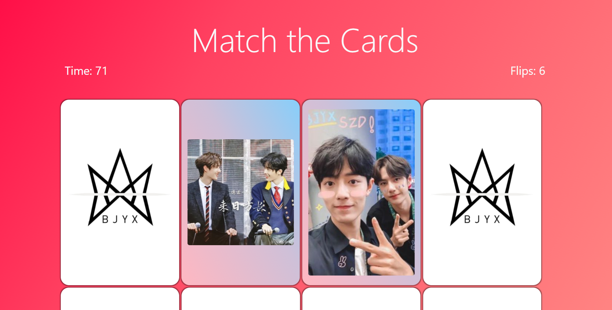

# BJYX Card Match

A simple card matching game using HTML, CSS, Bootstrap and Javascript. Some specs and the images in the game are from the BJYX fandom.

## Installation & Usage

Go to this link to play the game: https://bjyxcardsmatch.herokuapp.com/

## Notes
I intentionally make all the cards bigger since it's easier to see the images in the card. Also, it makes the game a little harder as you have to scroll up and down.

## Contributing
Pull requests are welcome. For major changes, please open an issue first to discuss what you would like to change.

Please make sure to update tests as appropriate.

